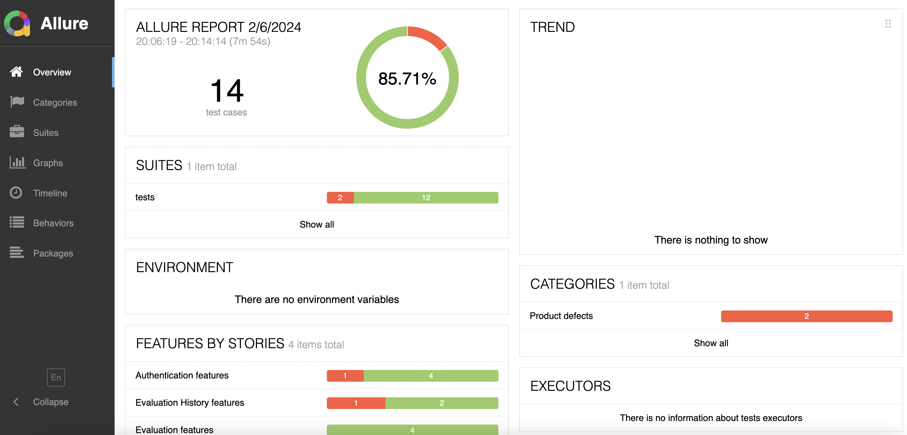

# Evaluation System:
The Asal Employee Evaluation System is designed to facilitate the evaluation process for employees at Asal. 
Each employee is assigned a direct supervisor responsible for evaluating their performance.
## installation:
This project is built over a Python environment, so all the dependencies are installed.
All you have to do is set up `python`, `pip`, `Allure`

## Reporting:
The project utilizes Allure for comprehensive test reporting. To view the test results, follow these steps:

After running the tests, generate the Allure report by executing the following command in your terminal:
```
allure serve
```
This command will start a local server hosting the Allure report. Open your web browser and navigate to the provided URL to view the detailed test results.


## Credentials:
To access the web application, use the provided testing accounts located in the `config.json` file. This file contains credentials for both supervisors and employees.


## Project Structres:
1. `pageObject`: Contains the Page Object Models for different components of the application, including login, home, employee evaluation, supervisor evaluation, and evaluation history.
2. `test`: Contains the test scenarios for the evaluation system.
3. `conftest`: Houses configuration fixtures required for the project.

## Pending TODO:
1. generate different screen sizes for each session.
2. put the selected browser in the JSON file, so it can run the desired browser.
3. find a way to open the evaluation for each session, currently the web having an issue.
4. adding more testing scenarios.
